# UNGA Project Connect Prototype

## Motivation

The goal of this project is to crowdsource and gamify the validation of geolocation data for schools around the world. We need as much help as we can get by looking at satellite imagery at predefined GPS coordinates, and corroborate whether what the user is seeing could be a school or not.

This effort is framed within [Project Connect](https://www.projectconnect.world/), run by the [UNICEF Office of Innocation](https://www.unicef.org/innovation/),  with the goal of 
knowing where schools are and how connected they are to inform programmes around education, health and emergencies. Project Connect emerged out of a need that was expressed by many UNICEF partners and UNICEF Country Offices.

## Roadmap
[](https://mermaid-js.github.io/mermaid-live-editor/#/edit/eyJjb2RlIjoiZ2FudHRcbiAgdGl0bGUgUm9hZG1hcFxuICBkYXRlRm9ybWF0IFlZWVktTU0tRERcbiAgYXhpc0Zvcm1hdCAgJWItJVlcbiAgc2VjdGlvbiBQaGFzZSAxXG4gIDEuIENyZWF0ZSBGcm9udCBFbmQgOmRvbmUsIDIwMjAtMDgtMDEsIDYwZFxuICAyLiBDcmVhdGUgQmFjayBFbmQgIDphY3RpdmUsIDIwMjAtMDgtMDEsIDYwZFxuICAzLiBEeW5hbWljIGltYWdlcyA6YWN0aXZlLCAyMDIwLTA4LTAxLCA2MGRcbiAgNC4gQmxvY2tjaGFpbiBjZXJ0c-KAiyA6MjAyMC0wOC0wMSwgNjBkXG4gIDUuIERlcGxveSArIGxhdW5jaCEgOjIwMjAtMDgtMDEsIDYwZFxuXG4gIHNlY3Rpb24gUGhhc2UgMlxuICAxLiBGZWVkYmFjayBnYXRoZXJpbmc6MjAyMC0xMC0wMSwgOTBk4oCLXG4gIDIuIERlc2lnbiAmIGZ1bmN0aW9uYWwgdXBkYXRlcyA6YjIsIDIwMjAtMTAtMDEsIDkwZOKAi1xuICAzLiBTb2NpYWwgbWVkaWEgaW50ZWdyYXRpb24gOmIzLCAyMDIwLTEwLTAxLCA5MGTigItcbiAgNC4gR2FtaWZpY2F0aW9uIGV4cGxvcmF0aW9uIDpiNCwgMjAyMC0xMC0wMSwgOTBk4oCLXG4gIDUuIEluY2VudGl2ZXMgKyBibG9ja2NoYWluICDigIs6YjUsIDIwMjAtMTAtMDEsIDkwZOKAi1xuICA2LiBEZXBsb3kgKyBsYXVuY2ghIDpiNSwgMjAyMC0xMC0wMSwgOTBk4oCLXG4gXG4gIHNlY3Rpb24gRnV0dXJlXG4gIDEuIEZlZWRiYWNrIGdhdGhlcmluZzoyMDIxLTAxLTAxLCAxODBk4oCLXG4gIDIuIERlc2lnbiAmIGZ1bmN0aW9uYWwgdXBkYXRlcyA6MjAyMS0wMS0wMSwgMTgwZOKAi1xuICAzLiArIG90aGVyIGRhdGEgYWdncmVnYXRvcnMgLT4gTUwgbW9kZWxzIDoyMDIxLTAxLTAxLCAxODBk4oCLIiwibWVybWFpZCI6eyJ0aGVtZSI6ImRlZmF1bHQiLCJ0aGVtZVZhcmlhYmxlcyI6eyJiYWNrZ3JvdW5kIjoid2hpdGUiLCJwcmltYXJ5Q29sb3IiOiIjRUNFQ0ZGIiwic2Vjb25kYXJ5Q29sb3IiOiIjZmZmZmRlIiwidGVydGlhcnlDb2xvciI6ImhzbCg4MCwgMTAwJSwgOTYuMjc0NTA5ODAzOSUpIiwicHJpbWFyeUJvcmRlckNvbG9yIjoiaHNsKDI0MCwgNjAlLCA4Ni4yNzQ1MDk4MDM5JSkiLCJzZWNvbmRhcnlCb3JkZXJDb2xvciI6ImhzbCg2MCwgNjAlLCA4My41Mjk0MTE3NjQ3JSkiLCJ0ZXJ0aWFyeUJvcmRlckNvbG9yIjoiaHNsKDgwLCA2MCUsIDg2LjI3NDUwOTgwMzklKSIsInByaW1hcnlUZXh0Q29sb3IiOiIjMTMxMzAwIiwic2Vjb25kYXJ5VGV4dENvbG9yIjoiIzAwMDAyMSIsInRlcnRpYXJ5VGV4dENvbG9yIjoicmdiKDkuNTAwMDAwMDAwMSwgOS41MDAwMDAwMDAxLCA5LjUwMDAwMDAwMDEpIiwibGluZUNvbG9yIjoiIzMzMzMzMyIsInRleHRDb2xvciI6IiMzMzMiLCJtYWluQmtnIjoiI0VDRUNGRiIsInNlY29uZEJrZyI6IiNmZmZmZGUiLCJib3JkZXIxIjoiIzkzNzBEQiIsImJvcmRlcjIiOiIjYWFhYTMzIiwiYXJyb3doZWFkQ29sb3IiOiIjMzMzMzMzIiwiZm9udEZhbWlseSI6IlwidHJlYnVjaGV0IG1zXCIsIHZlcmRhbmEsIGFyaWFsIiwiZm9udFNpemUiOiIxNnB4IiwibGFiZWxCYWNrZ3JvdW5kIjoiI2U4ZThlOCIsIm5vZGVCa2ciOiIjRUNFQ0ZGIiwibm9kZUJvcmRlciI6IiM5MzcwREIiLCJjbHVzdGVyQmtnIjoiI2ZmZmZkZSIsImNsdXN0ZXJCb3JkZXIiOiIjYWFhYTMzIiwiZGVmYXVsdExpbmtDb2xvciI6IiMzMzMzMzMiLCJ0aXRsZUNvbG9yIjoiIzMzMyIsImVkZ2VMYWJlbEJhY2tncm91bmQiOiIjZThlOGU4IiwiYWN0b3JCb3JkZXIiOiJoc2woMjU5LjYyNjE2ODIyNDMsIDU5Ljc3NjUzNjMxMjglLCA4Ny45MDE5NjA3ODQzJSkiLCJhY3RvckJrZyI6IiNFQ0VDRkYiLCJhY3RvclRleHRDb2xvciI6ImJsYWNrIiwiYWN0b3JMaW5lQ29sb3IiOiJncmV5Iiwic2lnbmFsQ29sb3IiOiIjMzMzIiwic2lnbmFsVGV4dENvbG9yIjoiIzMzMyIsImxhYmVsQm94QmtnQ29sb3IiOiIjRUNFQ0ZGIiwibGFiZWxCb3hCb3JkZXJDb2xvciI6ImhzbCgyNTkuNjI2MTY4MjI0MywgNTkuNzc2NTM2MzEyOCUsIDg3LjkwMTk2MDc4NDMlKSIsImxhYmVsVGV4dENvbG9yIjoiYmxhY2siLCJsb29wVGV4dENvbG9yIjoiYmxhY2siLCJub3RlQm9yZGVyQ29sb3IiOiIjYWFhYTMzIiwibm90ZUJrZ0NvbG9yIjoiI2ZmZjVhZCIsIm5vdGVUZXh0Q29sb3IiOiJibGFjayIsImFjdGl2YXRpb25Cb3JkZXJDb2xvciI6IiM2NjYiLCJhY3RpdmF0aW9uQmtnQ29sb3IiOiIjZjRmNGY0Iiwic2VxdWVuY2VOdW1iZXJDb2xvciI6IndoaXRlIiwic2VjdGlvbkJrZ0NvbG9yIjoicmdiYSgxMDIsIDEwMiwgMjU1LCAwLjQ5KSIsImFsdFNlY3Rpb25Ca2dDb2xvciI6IndoaXRlIiwic2VjdGlvbkJrZ0NvbG9yMiI6IiNmZmY0MDAiLCJ0YXNrQm9yZGVyQ29sb3IiOiIjNTM0ZmJjIiwidGFza0JrZ0NvbG9yIjoiIzhhOTBkZCIsInRhc2tUZXh0TGlnaHRDb2xvciI6IndoaXRlIiwidGFza1RleHRDb2xvciI6IndoaXRlIiwidGFza1RleHREYXJrQ29sb3IiOiJibGFjayIsInRhc2tUZXh0T3V0c2lkZUNvbG9yIjoiYmxhY2siLCJ0YXNrVGV4dENsaWNrYWJsZUNvbG9yIjoiIzAwMzE2MyIsImFjdGl2ZVRhc2tCb3JkZXJDb2xvciI6IiM1MzRmYmMiLCJhY3RpdmVUYXNrQmtnQ29sb3IiOiIjYmZjN2ZmIiwiZ3JpZENvbG9yIjoibGlnaHRncmV5IiwiZG9uZVRhc2tCa2dDb2xvciI6ImxpZ2h0Z3JleSIsImRvbmVUYXNrQm9yZGVyQ29sb3IiOiJncmV5IiwiY3JpdEJvcmRlckNvbG9yIjoiI2ZmODg4OCIsImNyaXRCa2dDb2xvciI6InJlZCIsInRvZGF5TGluZUNvbG9yIjoicmVkIiwibGFiZWxDb2xvciI6ImJsYWNrIiwiZXJyb3JCa2dDb2xvciI6IiM1NTIyMjIiLCJlcnJvclRleHRDb2xvciI6IiM1NTIyMjIiLCJjbGFzc1RleHQiOiIjMTMxMzAwIiwiZmlsbFR5cGUwIjoiI0VDRUNGRiIsImZpbGxUeXBlMSI6IiNmZmZmZGUiLCJmaWxsVHlwZTIiOiJoc2woMzA0LCAxMDAlLCA5Ni4yNzQ1MDk4MDM5JSkiLCJmaWxsVHlwZTMiOiJoc2woMTI0LCAxMDAlLCA5My41Mjk0MTE3NjQ3JSkiLCJmaWxsVHlwZTQiOiJoc2woMTc2LCAxMDAlLCA5Ni4yNzQ1MDk4MDM5JSkiLCJmaWxsVHlwZTUiOiJoc2woLTQsIDEwMCUsIDkzLjUyOTQxMTc2NDclKSIsImZpbGxUeXBlNiI6ImhzbCg4LCAxMDAlLCA5Ni4yNzQ1MDk4MDM5JSkiLCJmaWxsVHlwZTciOiJoc2woMTg4LCAxMDAlLCA5My41Mjk0MTE3NjQ3JSkifX19)

*Note: to update the roadmap do the following:*
1. *Click on the SVG image above, which will open a live editor with the current version (content is encoded in the URL)*
2. *Once you have made the changes, copy the address link of the live editor and update the link above*
3. *On the live editor, click on the link to the SVG, look at the source, and update the [docs/roadmap.svg](docs/roadmap.svg) file*
